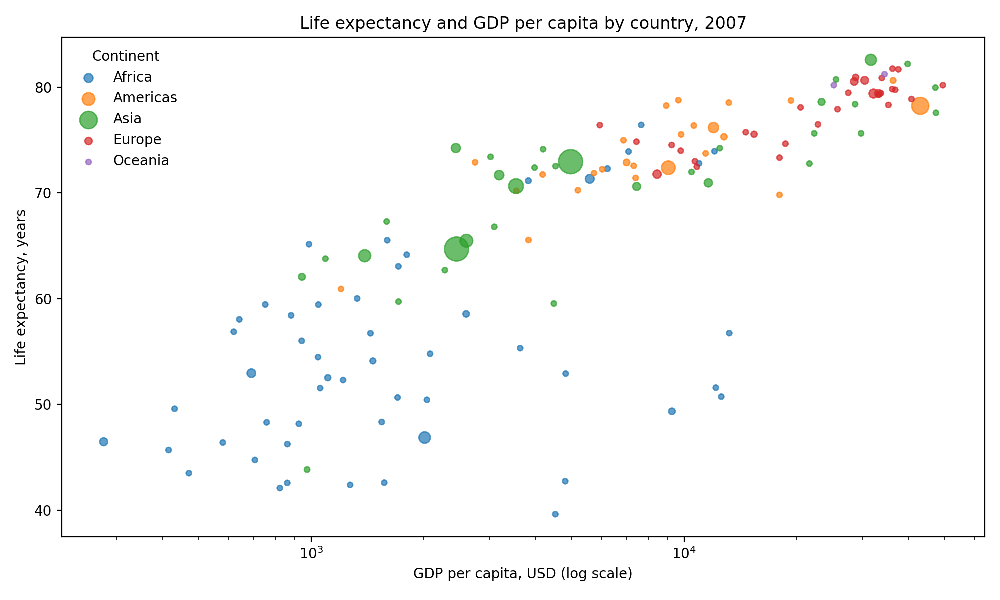
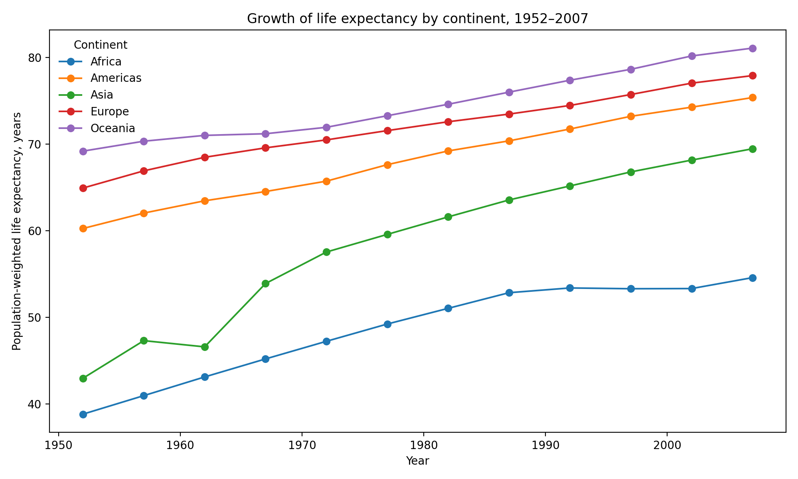
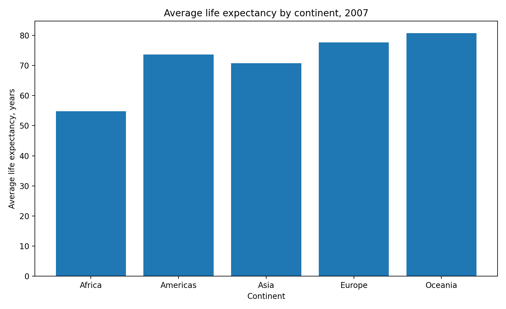
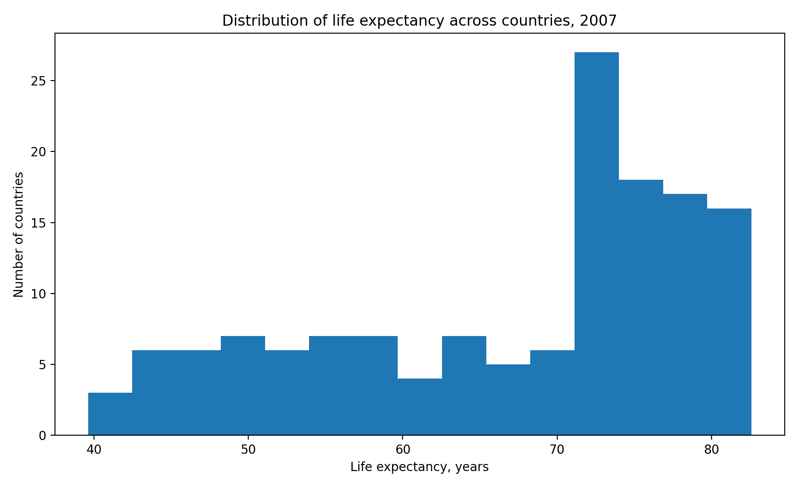

# Итоговый проект: связь уровня дохода и продолжительности жизни в странах мира

## Синопсис
Этот проект исследует, как связаны **ВВП на душу населения**, **ожидаемая продолжительность жизни** и **численность населения** в разных странах мира. Для анализа использован набор данных Gapminder — международный датасет с показателями по странам за 1952–2007 годы.

Цель проекта — показать, как с помощью обработки данных, базовой статистики и визуализации можно ответить на важный исследовательский вопрос: **связано ли экономическое благополучие страны с качеством и продолжительностью жизни населения?**

## Актуальность
Тема актуальна, потому что показатели жизни и дохода часто используются как базовые индикаторы развития стран. Сравнение этих метрик помогает увидеть глобальные различия между регионами мира и понять, как экономические факторы соотносятся со здоровьем и долголетием.

## Исследовательские вопросы
1. Есть ли связь между ВВП на душу населения и продолжительностью жизни?
2. Какие регионы мира демонстрируют самые высокие и самые низкие значения продолжительности жизни?
3. Как менялась продолжительность жизни по континентам в 1952–2007 годах?
4. Насколько равномерно распределены значения продолжительности жизни между странами в 2007 году?

## Данные
Источник данных: датасет **Gapminder** (страны мира, 1952–2007).  
В проекте использованы следующие переменные:
- `country` — страна
- `continent` — континент
- `year` — год
- `life_expectancy` — ожидаемая продолжительность жизни
- `population` — численность населения
- `gdp_per_capita` — ВВП на душу населения
- `gdp_total_usd` — рассчитанный совокупный ВВП (`population * gdp_per_capita`)

### Очистка и подготовка данных
Были выполнены следующие шаги:
- проверены типы данных;
- стандартизированы названия столбцов;
- удалены лишние пробелы в текстовых полях;
- добавлен вычисляемый показатель совокупного ВВП;
- данные сохранены отдельно в `data/raw/` и `data/clean/`.

См. папку [`data/`](data/).

## Анализ
Для анализа использован срез по **2007 году**, а также динамика по континентам за весь период 1952–2007.

### Базовая статистика
Сводная статистика по 2007 году находится в файле:
- [`summary_stats_2007.csv`](data/clean/summary_stats_2007.csv)

### Ключевые выводы
1. Между ВВП на душу населения и продолжительностью жизни наблюдается **положительная связь**: страны с более высоким доходом обычно имеют более высокую ожидаемую продолжительность жизни.
2. В 2007 году лидером по продолжительности жизни была **Japan** (82.6 лет), а минимальное значение было у **Swaziland** (39.6 лет).
3. Самый высокий ВВП на душу населения в 2007 году был у **Norway** (49357 USD), а самый низкий — у **Congo, Dem. Rep.** (278 USD).
4. В среднем самые высокие значения продолжительности жизни в 2007 году наблюдались в **Oceania**, а самые низкие — в **Africa**.
5. Рост доходов не гарантирует линейного роста продолжительности жизни: после определенного уровня ВВП рост ожидаемой продолжительности жизни становится менее резким.

## Визуализации

### 1. Связь между ВВП на душу населения и продолжительностью жизни


На диаграмме видно, что страны с низким доходом чаще имеют более низкую продолжительность жизни, а затем зависимость начинает сглаживаться.

### 2. Рост продолжительности жизни по континентам


По всем континентам наблюдается рост продолжительности жизни, но темпы роста различаются.

### 3. Средняя продолжительность жизни по континентам в 2007 году


Сравнение показывает межрегиональные различия, которые хорошо видны даже на агрегированном уровне.

### 4. Распределение продолжительности жизни между странами


Гистограмма показывает, что большинство стран сосредоточено в верхней части диапазона, но сохраняется заметный хвост стран с низкими значениями.

## Референсы
1. Gapminder — международный проект визуализации и объяснения данных о развитии стран.
2. Plotly Express dataset reference.
3. Примеры открытых data-driven проектов на GitHub и Our World in Data.

## Инструменты
- Python
- pandas
- matplotlib
- GitHub
- CSV / Markdown

## Структура репозитория
```text
data/
  raw/
  clean/
visualizations/
scripts/
README.md
```

## Как воспроизвести проект
1. Скачать репозиторий.
2. Открыть файл `data/clean/gapminder_clean.csv`.
3. При необходимости перегенерировать графики с помощью `scripts/make_project.py`.
4. Опубликовать проект в публичном GitHub-репозитории.

## Итог
Проект показывает, что даже на небольшом открытом датасете можно провести полноценное mini data-driven исследование: собрать данные, очистить их, сформулировать выводы и визуально представить результаты в формате, пригодном для публикации на GitHub.
